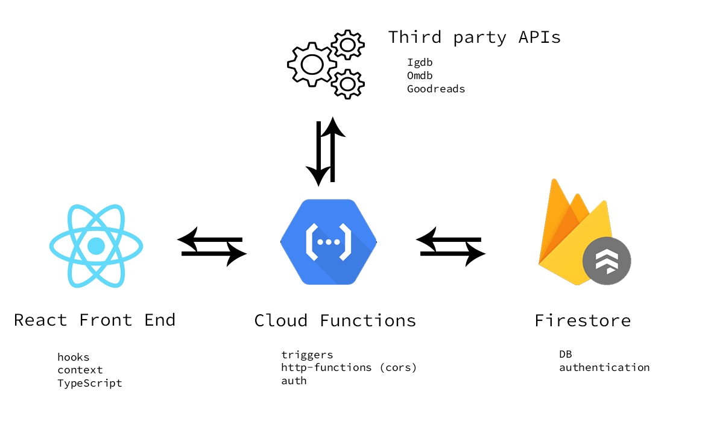

## Kiosk

##### **_ This is a work-in-progress _**

### `Architecture`

### `Purpose`

This is a WIP social web app to share current media consumption among friends and view recommendations based on selections. Films and TV Series components will retrieve data from [OMDB](https://www.omdbapi.com/), Games from [IGDB](https://www.igdb.com/discover) and Books from [Google Books](https://developers.google.com/books).

React with TypeScript is used client-side, with a Cloud Function acting as a proxy server for some API
calls and DB subscriptions/triggers. Firestore is used for Authentication and as a Database.

Authentication in the client is managed using the React Context API. React-Select is used to search for and persist data from the APIs. All lifecycle events are handled using React Hooks. Styling is achieved with a mix of Styled-Components and Material UI.

Using a Cloud Function as a gateway allows us to bypass CORS issues and listen for DB changes with hooks provided by Firebase such as `authOnCreate` or `authOnDelete`. It also provides a layer to handle some of the authentication logic.

Firestore expedites development by providing tooling for the database layer and deep integration with client-side JavaScript frameworks.

### `To Do`

1. Refactor hacky code.
2. ~~Implement shareable link for unauthenticated activity sharing.~~
3. Add Types where missing/broken.
4. Set up PROD credentials/api keys.
5. Finish UI/UX.
6. ~~Local development walkthrough.~~
7. Implement friends and feed functionality.

### Created using [React](https://reactjs.org/), [TypeScript](https://www.typescriptlang.org/), and [Google Firebase](https://firebase.google.com/).
